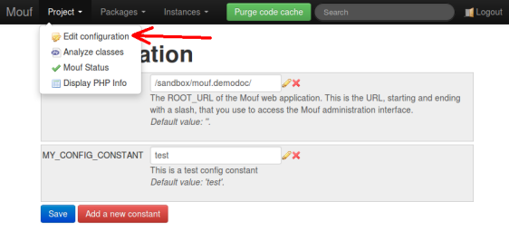
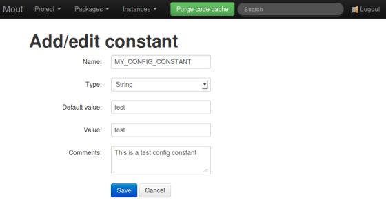
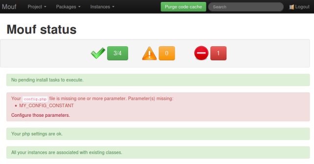
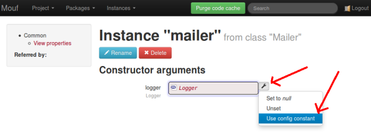
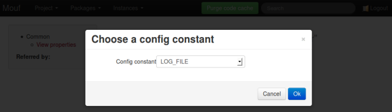
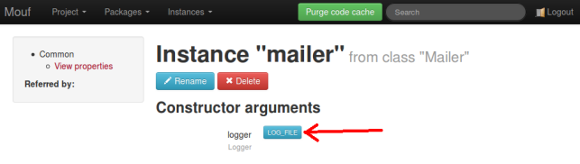

Managing configuration with Mouf
================================

Mouf can help you manage the configuration of your application.
We consider a variable to be part of the configuration if:

- **It is specific to an environment**: for instance, the URL, user name and password required to access a database depend 
	on the environment. You are not using the same database in development and in production environments.
- **It is constant**: it should never change at runtime.

The configuration file
----------------------

Mouf can automatically read and write your configuration file. The name of the configuration file is `config.php`, and it is always at
the root of your web application.

Here is a sample `config.php` file:

```php
<?php
/**
 * This is a file automatically generated by the Mouf framework. Do not put any code except 'define' operations
 * as it could be overwritten.
 * Instead, use the Mouf User Interface to set all your constants: http://[server]/mouf/mouf/config
 */

/**
 * The ROOT_URL of the Mouf web application. This is the URL, starting and ending with a slash, that you use to access the Mouf administration interface.
 */
define('ROOT_URL', '/myapp/');
/**
 * The database host (the IP address or URL of the database server).
 */
define('DB_HOST', 'localhost');
/**
 * The database port (the port of the database server, keep empty to use default port).
 */
define('DB_PORT', '');
/**
 * The name of your database.
 */
define('DB_NAME', 'testlogs');
/**
 * The username to access the database.
 */
define('DB_USERNAME', 'root');
/**
 * The password to access the database.
 */
define('DB_PASSWORD', '');
?>
```

As you can see, each configuration item is declared with a `define` command.

When you install only Mouf, with no related packages, this file will contain only one parameter: `ROOT_URL`.
This is the "web-path" to your application. If you happen to change the path to your web-app, you will have
to change this variable manually.

The `config.php` file can be directly edited in the Mouf administration interface:



You can change a parameter in the user interface and the `config.php` file will automatically be regenerated.
You can change a parameter in the `config.php` file and the value will change in the user interface. This means
using the user interface to change config parameters is optionnal.

Since Mouf is using `define` to declare the configuration, a configuration constant cannot be an array or a PHP object.
If you want to use arrays or objects in your configuration, you will need to do that in a separate file.   

Working in team
---------------
###The problem

If you work in a team, you are probably using a code repository like Subversion, GIT or CVS. If you do so,
the last file you want to commit is `config.php`. Indeed, this file contains the configuration that is
specific to your workstation. It might even contain sensitive data (like passwords, etc...)

So try to remember:
<div class="info"><strong><code>config.php</code> must not be commited</strong></div>

But not commiting `config.php` comes with its own set of problems. Indeed, if you are a new developer
arriving on a project, you would need to know what to put in the `config.php`. On most PHP project,
someone will end up writing a `config.template.php` file that will be commited, and that you will
use as a base for your own `config.php` file. This works, but it is far from a perfect solution.
Imagine some developer adds a new variable to `config.php`. He must think about adding that variable
to `config.template.php`. Most of the time, he will forget. And even if he does remember to edit `config.template.php`,
all the other developers working on the same project will need to notice the variable has been added and add it 
in their own `config.php`.

###Mouf's solution

Hopefully, Mouf comes with a solution to that problem. Indeed, when you add a new configuration variable using the Mouf UI,
Mouf does not only add the variable to `config.php`.



When you declare a new constant (see screenshot above), Mouf will also store the name 
of the constant, the documentation string associated to that variable, and a default value for this variable in a file named `MoufComponents.php`.
If you work in a team, `MoufComponents.php` should be versioned. This way, you can share with all your
team the name of the configuration constant, its documentation, and a default value, without sharing the actual value
of the configuration for your workstation.

If you add a new configuration constant and commit `MoufComponents.php`, the other developers working with
you will be notified in the status screen (the screen that displays just after you log into Mouf).
Here is the message they will see:



<strong>Bonus:</strong> if a developer is adding a variable directly into `config.php` without going
through Mouf's user interface, the developer will be noticed in the status screen and will be offered to register
 this new constant with Mouf.  

Using constants with dependency injection
-----------------------------------------

Let's assume you write an application that contains a logger that logs into a file.
This constant might be named `LOG_FILE`.
Because you are using Mouf, you will certainly have one instance representing the logger, and the file
the logger is writing to might be passed in parameter.
In dependency injection terms, this means you will want to be able to inject a configuration constant 
into a property of the logger instance.

To do this, you just need to go in your instance page. Next to the name of the property you want to bind to a constant,
you will notice a small tool icon.



Click on that icon. A "Property source" pop-up will open.
Select "Use config constant" as the property source. Then, select the property you want to bind the variable to:



We are done, your property is bound to the config constant. Notice the how the constant is displayed in 
a light blue box next to the property name. 



