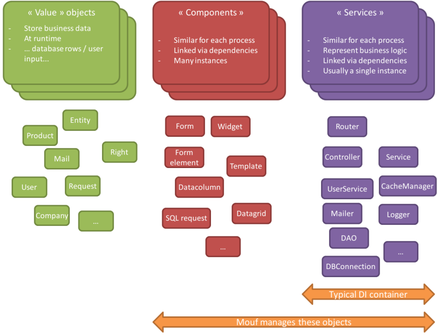
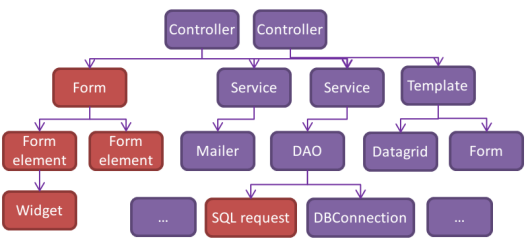

Getting started with dependency injection
=========================================

At the core of Mouf, there is a high performance graphical dependency injection library.
The whole Mouf framework revolves around that feature, so if you don't know about dependency injection,
it's time to get a quick course.

TL;DR?
------
Too long to read? <a href="mouf_di_ui.md" class="btn btn-primary">Jump directly to the video &gt;</a>

What is dependency injection, and why bother?
---------------------------------------------
Dependency injection is a way (a design pattern) to organize the objects of your application cleanly.
Before diving into DI (dependency injection), let's make a small classification.

###Classifying PHP objects


A typical PHP application contains a bunch of objects (or instances) that come from classes.



We can really split those objects into 3 categories:

- **"Value" objects**:
	- They usually store user data
	- They are different each time your application runs (for instance, an instance of a class representing 
a database row, or user input)
- **Components**:
	- Usually utility classes or widgets (a form element, an object representing a SQL request...)
	- They are similar for each requests
- **Services**:
	- They represent the "business logic" of the application
	- They are similar for each requests
	- Usually, there is a single instance for each class (for instance, a database connection,
	a logger, a mailer, etc...)
	
###Dependency injection

A dependency injection container (DIC) will help you to 
instanciate cleanly objects and to reduce the coupling between these objects.

The DIC is in charge of creating/managing instances of the classes you use.



In the example above, you could request a "controller" to the DIC and the DIC would in turn
create instances of all the services / components that are needed by this controller. 
 
Basically, you declare in a configuration file the list of all instances
you want to use and the DIC will instantiate those for you and manage the dependencies between these
instances for you. Essentially, you use a **configuration file to declare your instances instead of using PHP code**.

This has a number of advantages (maintainability, testability, self-description...), but soon, you end up with a very 
complex configuration file. Therefore, in most frameworks out there (Symfony 2, Zend Framework 2...), 
dependency injection is only used to manage services (about 50 instances per applications top). 

Mouf is **taking dependency injection to a whole new level**. Using a **web-based interface**, 
you can very easily manage your instances. Therefore, things that where out of the reach of the DI container
suddenly become likely candidates.

- You have an object representing a datagrid? Put it in Mouf!
- You have an object representing a column of a table? Put it in Mouf!
- You have an object representing a SQL request? Put it in Mouf!
- You have an object representing a form or a form element? Put it in Mouf!
- ...

You get the idea. Put as many objects as possible in Mouf's container. Mouf takes spaguetti code away
so you can focus on the real interesting part of your project.

<div class="alert alert-info"><strong>Mouf</strong> is a unique <em>dependency injection
container</em> (DIC). Most other PHP DIC out there are focusing on <strong>services only</strong>.
This is either by design, or because the way they are not flexible enough.
Mouf extends the DIC to <strong>components</strong> and this is what
makes this framework so special.</div>

Getting your classes ready for dependency injection
---------------------------------------------------
In order to use Mouf efficiently, you will have to respect some best practices when designing your classes.

The while idea is quite simple:

<div class="alert alert-info">If you need an instance of a service or a component, try avoiding creating the 
instance using the <code>new</code> keyword. Instead, pass the requested instance in parameter (to the 
constructor or a setter), and let Mouf inject the dependency.</div>


###Without dependency injection, your instances management can go wrong


Here is a sample of what you should NOT do. I have a `Mailer` class in charge of sending mails.
I want my class to be able to log each mail sent in a file. For this, I want to use the `Logger` class.

The first coding attempt would be something like this:

**Mailer.php**
```php
class Mailer {
	private $logger;
	
	public function __construct() {
		$this->logger = new Logger();
	}
	
	public function sendMail($to, $title, $text) {
		// Do stuff to send the mail
		// Once sent, let's log it.
		$this->logger->log("Mail sent");
	}
}
```

**Logger.php**
```php
class Logger {
	private $fp;

	public function __construct() {
		$this->fp = fopen("logfile.txt", "a");
	}
	
	public function log($text) {
		fwrite($this->fp, $text);
	}

}
```

**Usage**
```php
// Usage:
$mailer = new Mailer();
$mailer->sendMail('toto@example.com', 'title', 'body');
```

This first attempt has a number of **drawbacks**.
First of all, the `Mailer` class needs the `Logger` class. There is a **"dependency"**. Because we instanciate 
the `Logger` in the Mailer's constructor, there is no easy way to get a mailer with a different logger.

Furthermore, if you want to have another service to access the logger, it will have to create its own instance,
and things might go wrong if we try to open the same file several times. We should really have only one
instance of the logger.

Finally, the logfile name should be configurable.

###Second try, let's get rid of the dependency


In this second try, we will move the dependency out of the classes.

**Mailer.php**
```php
class Mailer {
	/** @var Logger */
	private $logger;
	
	/**
	 * @var Logger $logger
	 */
	public function __construct(Logger $logger) {
		$this->logger = $logger;
	}
	
	/**
	 * @param string $to
	 * @param string $title
	 * @param string $text
	 */
	public function sendMail($to, $title, $text) {
		// Do stuff to send the mail
		// Once sent, let's log it.
		$this->logger->log("Mail sent");
	}
}
```

**Logger.php**
```php
class Logger {
	private $fp;

	public function __construct($logfile) {
		$this->fp = fopen($logfile, "a");
	}
	
	public function log($text) {
		fwrite($this->fp, $text);
	}

}
```

**Usage**
```php
// Usage => less easy
$logger = new Logger("logfile.txt");
$mailer = new Mailer($logger);
$mailer->sendMail('toto@example.com', 'title', 'body');
```

This approach is **cleaner**. Because the `Mailer` class is not bound to the `Logger` class, we could
replace our class with another class (provided they share a common *interface*). However, using the class
is now difficult. In particular, we have to create the logger object first, and pass it to the mailer
object. In this exemple, these are only 2 lines of code, but imagine instanciating a controller that requires
a mailer, a database connection, a logger, a templating service, etc... Your code creating instances can
quickly become complex and difficult to maintain. This is the **spaghetti code effect**.

This is where **Mouf** comes to the rescue.

Mouf will manage the instanciation code for you. Instead of writing spaghetti code, you use Mouf's 
web-based user interface. You define your instances easily, they are stored in a "container" (this is
actually one big configuration file managed by Mouf), and you can get your instances from the container 
easily as well.

<a href="mouf_di_ui.md" class="btn btn-primary">So let's get started! &gt;</a>
