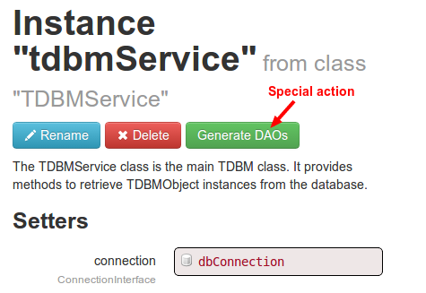
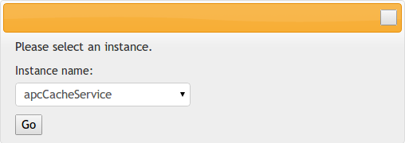

Extending Mouf's user interface
===============================

Mouf has a great user interface, but what makes it really powerful is that it can be extended and
modified by any package (and even by the root application). 

In your package, you can write custom controllers and views in order to add your own user interface.

There are plenty of hook points that let you:

- add menu items
- add HTML in any zone
- add any controller

Let's focus on the most common use case: adding a controller.

Understanding Mouf structure
----------------------------

Mouf is a twin-head beast. On one side, there is the application the user is developping. On the other side (in the `vendor/mouf/mouf` folder), there is Mouf's web-based IDE. So basically, **there are 2 applications in one**. Each application has its **own set of dependencies and autoloader**.

Like with any Composer application, dependencies of the application are stored in the `vendor` folder. The dependencies of Mouf are stored in the `vendor/mouf/mouf/vendor` folder.

... and in case you are wondering, Mouf is developed using Mouf (yes, it is recursive!)

When you write an extension for the Mouf user interface, you want to add classes / controllers / views / dependencies
to the Mouf application, not your application.

To do this, starting with Mouf 2.1, any package (including the root package) can have **2 composer files**:


- the regular `composer.json` file contains the settings of the main application
- an additional `composer-harmony.json` file contains the settings of the Mouf web-based IDE

Controllers, classes, views, dependencies dedicated to Mouf web-based IDE must go in the `composer-harmony.json` file.

<div class="alert alert-info">Mouf's own packages are stored in the <code>/vendor/mouf/mouf/vendor</code> directory.
The dependencies added by packages using <code>composer-harmony.json</code> will be stored in the <code>/vendor/mouf/mouf/vendor-harmony</code> directory.</div>

More about Mouf web-based UI
----------------------------

Mouf IDE uses a number of packages:

- Splash for the MVC part
- A Bootstrap based template
- ...

Therefore, when extending Mouf, you will have to [write Splash controllers](http://mouf-php.com/packages/mouf/mvc.splash/index.md).
Finally, you will have to declare the controller instance manually, but we will see this in the next chapter. Before reading through this document, please be sure you understand [the way Splash works](http://mouf-php.com/packages/mouf/mvc.splash/index.md)!

<div class="alert alert-info">
This means that your project and Mouf can use a different version of Splash for instance.<br/><br/>
Mouf has its own container, with its own <code>mouf/instances.php</code> file (see the "vendor/mouf/mouf/mouf/instances.php" file).
This file contains all the instances used by Mouf.
Your package <b>cannot</b> modify this file.<br/><br/>
However, at runtime, you can add your own instances in the Mouf's container, or register an additional container
that will be used by Mouf.</div>


*Global* vs *instance related* pages
------------------------------------

When you extend the user interface, the first question you must ask is: 
*"Is my user interface dependent on a particular instance or not?"*.
Most of the time, it is, but it might not always be true.

For instance:

Let's suppose you are developing a cache system, like the one in package [utils.cache.cache-interface](http://mouf-php.com/packages/mouf/utils.cache.cache-interface/README.md).
You will certainly end-up with instances representing different cache services. You might want to offer a special user interface for the user to purge the cache.
If your user interface is purging all caches at once, it is a **global** user interface.
On the other end, if you must first choose what instance you are working on before purging the cache, 
you are working on a **instance related** user interface.

Registering classes
-------------------

The first step will be to write a `composer-harmony.json` file to register your controller.

**composer-harmony.json**
```json
{
	TODO
}
```


TODO Structure:

1- Register classes / dependencies
2- Create a controller (explain that we can also register other routers (stack-php) => link to how)
3- Create an instance (container-interop)


Using Mouf internal API
-----------------------

If you want to extend the administration interface, it is almost sure you will want to create or modify 
instances programmatically. You can learn how to do this in the ["Managing instances programmatically" section](managing_instances_programmatically.md).


Registering an 'admin' file (deprecated)
----------------------------------------

<div class="alert"><b>Important:</b> Starting with Mouf 2.1, 'admin' files are deprecated. Register
additional containers instead.</div>

In order to register your own instances at runtime, your package can declare an "admin" file.
An "admin" file is a file that is executed each time a request if performed in the Mouf user interface.

If you already read the [*Writing an install process*](install_process.md) documentation, you should already
be familiar with this kind of file.

In order to declare an "admin" file, you need to add a `require-admin` section in the **extra/mouf** section
of the `composer.json`

**composer.json**
```json
{
	...
	"extra" : {
		"mouf" : {
			"require-admin" : [
				"src/MyAdminFile.php"
			]
		}
	},
	...
}
```

In this sample, the `src/MyAdminFile.php` will be executed each time a request is made to the Mouf user interface.

<div class="alert"><b>Important:</b> Mouf will not detect any changes you make to <code>composer.json</code>
unless you commit/push the changes in your repository and you run a <code>php composer.phar update</code>.
In other words, the <code>composer.json</code> file taken into account by Mouf is the one coming from
Packagist, not the one on your hard disk.</div>


Writing a **global** user interface
-----------------------------------

Let's get started by writing a global user interface. We will see the instance related user interface in the next chapter.
To get started, we need 3 files:

- src/MyVendor/Controller/MyAdminController.php: This file will contain the controller class.
- src/views/myAdminView.php: This file will contain the view (HTML code).
- src/MyAdminFile.php: We already spoke about this file in the previous chapter. It must be registered in the `composer.json`.

###Writing the controller

**MyAdminController.php**
```php
namespace MyVendor\Controller\MyAdminController;

...

/**
 * A sample controller that will be displayed in the administration interface.
 */
class MyAdminController extends Controller {
 
 	/**
	 * The content block that will contain the HTML.
	 * @var HtmlBlock
	 */
	public $content;
	
    /**
     * The default template to use for this controller (will be the Mouf template)
     * @var TemplateInterface
     */
    public $template;
     
    protected $selfedit;
     
    /**
     * The action displaying the page.
     *
     * @Action
     * @Logged
     */
    public function index($selfedit = "false") {
        // Do stuff
        
        $this->selfedit = $selfedit;
        $this->content->addFile(__DIR__."/../../views/myAdminView.php", $this);
        $this->template->toHtml();
    }
 
    ...
}
```

The controller is pretty standard. It contains a template property (that will be linked to the Mouf template).

<div class="alert alert-info">
<p><strong>What is this selfedit thing I see all around?</strong></p>
<p>As you already know, Mouf is developed using Mouf. So this means that the Mouf administration interface 
can also be used to administrate the Mouf administration interface (instead of your application).
To do this, you just have to put Mouf in <strong>selfedit mode</strong>, by appending <code>?selfedit=true</code> to any Mouf URL.
When you develop a package, unless you are a core Mouf developer, it is unlikely you will want to use this 
package in selfedit mode. You can therefore completely disregard this parameter. 
However, if your package may at some time be embeded in the code of Mouf (for instance, Splash is embedded
in Mouf, regardless of the fact the application developer is using Splash or not), then you will need to 
take the <strong>selfedit</strong> parameter into account, in order to know the context in which you are working.</p> 
</div>

###Writing the view

Now, let's develop the view:

**myAdminView.php**
```php
<?php /* @var $this MyVendor\Controller\MyAdminController */ ?>
 
This is the view file. You can put here any PHP and HTML you want to build your view.
```

###Registering the controller and adding a menu item

We already talked about the **MyAdminFile.php** and the way it was registered in **composer.json**.
Let's put some content in this file.

**src/MyAdminFile.php**
```php

// Let's create a sample menu for our controller.
// The MoufUtils::registerMenuItem is an easy to use function to create menu items quickly.
// First parameter is the menu item instance name
// Second parameter the text of the menu
// Third parameter the link to point to
// Fourth parameter the name of the parent menu instance (the top level menu is named "mainMenu"
// Last parameter is the priority of the menu. The lowest number ranks first.
MoufUtils::registerMainMenu('myMainMenu', 'My Menu', null, 'mainMenu', 70);
// Let's make a submenu itme
MoufUtils::registerMenuItem('mySubMenu', 'My submenu', null, 'myMainMenu', 80);
// And a sub-submenu item
MoufUtils::registerMenuItem('mySubSubMenu', 'My menu-item', ROOT_URL.'myAdminController/', 'mySubMenu', 10);
 
$moufManager = MoufManager::getMoufManager();

// Controller declaration
$moufManager->declareComponent('myAdminController', 'MyVendor\\Controller\\MyAdminController', true);
// Let's bind the "moufTemplate" instance to the "myAdminController".
$moufManager->bindComponents('myAdminController', 'template', 'moufTemplate');
// Let's bind the "block.content" instance to the "myAdminController".
$moufManager->bindComponents('myAdminController', 'content', 'block.content');
```

As you probably noticed, when declaring the controller, we are not using the `getInstanceDescriptor()` method
that is described in the ["Managing instances programmatically" section](managing_instances_programmatically.md).
Instead, we are using `declareComponent` and `bindComponents`. These are "low level" methods of 
the MoufManager that can add/edit instances really quickly. Since the code in **MyAdminFile.php** is run
on each request to Mouf, we need it to be lightning quick. This is why we are using those low-level methods
instead of the more advanced (and more slow) `getInstanceDescriptor()`.


Writing an **instance-related** user interface
----------------------------------------------

It might not be obvious at the beginning, but you will realize that most of your controllers/routes will probably
be related to an instance in your application. Let's see what tools Mouf offers to make this work
a little easier.

###Adding a **special action button** on the instance page

When you are on the instance page, you can add a special action button.
Special actions are actually additional pages that are specific to an instance.
Here is a sample special action you can see for any [TDBMService instance (package: database.tdbm)](https://github.com/thecodingmachine/database.tdbm/blob/3.1/src/Mouf/Database/TDBM/TDBMService.php#L37)



Adding a special action for an instance is very simple.
In the PHPDoc of the class, you just need to add a `@ExtendedAction` annotation.

Here is a sample:

```php
/**
 * @ExtendedAction {"name":"Generate DAOs", "url":"tdbmadmin/", "default":false}
 */
class TDBM_Service {
    ...
}
```

As you can see:

- the `name` attribute is the special action text displayed in the menu,
- the `url` attribute is the URL of the controller. Please note that the name of the instance will automatically be appended: ?name=[instancename].
- If the `default` attribute is set to true, the extended action will be displayed by default, instead of the default instance page. Using this feature, you can completely integrate a special action into the Mouf workflow.

###Using the **AbstractMoufInstanceController** base controller

Instead of extending your controller from the default `Controller` class, you might want to extend 
the `AbstractMoufInstanceController` class. It offers a number of advantages:

- It declares a template (you still have to bind your controller instance to the template)
- It automatically fills the left menu with useful menuitems:
	- A link to the instance's main page
	- The list of instances using this instance...
- It retrieves the instance so you can easily access it without going through the `MoufManager` class

Here is a sample:

**MyAdminController.php**
/**
 * A sample instance-specific admin controller
 */
class MyAdminController extends AbstractMoufInstanceController {
    /**
	 *
	 * @var HtmlBlock
	 */
	public $content;
	
    /**
     * Admin page for my instance
     *
     * @Action
     */
    public function index($name, $selfedit="false") {
        // Let's initialize the controller
        $this->initController($name, $selfedit);
         
        // In this code, you can access a number of variables:
        // $this->template points to the template
        // $this->moufManager points to the MoufManager instance
        // ...
        $this->content->addFile(__DIR__."/../../views/myAdminView.php", $this);
        $this->template->toHtml();
    }
}

###Special menus: menus that depend on instances

So far, things where easy:

- global actions are accessed through the main menu
- instance related actions are accessed through the "special action" menu, on the instance page

This is simple, but in many cases, you might want to **promote** a special action directly in the main menu.
Indeed, menu items displayed in the main menu are easier to find.

Mouf offers a simple way to add instance related actions in the main menu.
It works using a special kind of meny item that acts this way:

- When you click on the menu item, a pop-up is displayed, asking you to choose your instance. You select your instance, click the "ok" button and the instance-related controller is displayed
- If there is only one eligible instance for this special action, the drop-down is not displayed, you have a direct access to the controller for that special instance
- If there is no eligible instance, an message is displayed, explaining that we need at least one instance of type "X".

Here is what the "choose-instance" popup looks like when you click on the menu:



To develop such a popup, you will need to use the `MoufUtils::registerChooseInstanceMenuItem` method.
Here is how to code such a popup in your **MyAdminFile.php** file.

**src/MyAdminFile.php**
```php
use Mouf\MoufUtils;

MoufUtils::registerMainMenu('dbMainMenu', 'DB', null, 'mainMenu', 70);
MoufUtils::registerMenuItem('dbTDBMAdminSubMenu', 'DAOs', null, 'dbMainMenu', 80);
// First parameter: the name of the new menu item
// Second parameter: the label of the menu
// Third parameter: the URL we should access when the instance is selected. The instance name is automatically appended to the link.
//                  in this sample: tdbmadmin/?name=xxx where xxx is the name of the selected instance
// Fourth parameter: the name of the class or interface that is targeted
// Fifth parameter: the parent menu item
// Sixth parameter: the priority of the menu item compared to sibblings.
MoufUtils::registerChooseInstanceMenuItem('dbTDBMGenereateDAOAdminSubMenu', 'Generate DAOs', 'tdbmadmin/', "Mouf\\Database\\TDBM\\TDBMService", 'dbTDBMAdminSubMenu', 10);

...
```
