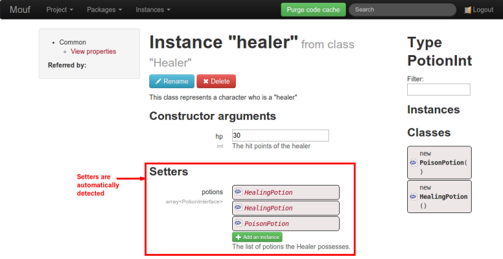
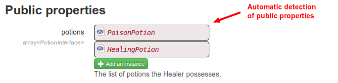

<a name="supportedinjectiontechniques"></a>
Supported injection techniques
==============================

<a href="http://mouf-php.com/packages/mouf/mouf/doc/injection_techniques.md" class="hidden">You are viewing this content from Github (that does not support
video embedding. Click here to view the video.</a>
<iframe width="853" height="480" src="//www.youtube.com/embed/o-1DW6yQ00I?rel=0&vq=hd720" frameborder="0" allowfullscreen></iframe>

When you work with Mouf, you can inject dependencies or parameters in your instances. If you want
to [use Mouf UI for dependency injection](mouf_di_ui.md), you can use 3 types of injection:

- [Constructor arguments](#constructorparmeterinjection)
- [Setters](#setterinjection)
- [Public properties](#publicpropertiesinjection)

<a name="constructorparmeterinjection"></a>
###Injecting values in constructor arguments

Mouf can inject values/instances in any constructor argument (actually, any argument that is not compulsory 
MUST be configured in Mouf, otherwise, Mouf won't be able to instantiate the object).

<div class="alert alert-info"><strong>Best practice:</strong> Put in the constructor any <strong>required</strong>
object. This way, you are sure the object is available in your class.</div>

In this sample, we will be modeling a "Healer". A Healer MUST have hit points (therefore, it is an
argument passed to the constructor).

**Sample**
```php
/**
 * This class represents a character who is a "healer"
 */
class Healer {
	private $hp;
	...
		
	/**
	 * @param int $hp The hit points of the healer
	 */
	public function __construct($hp) {
		$this->hp = $hp;
	}
	...
}
```

<div></div>


<a name="setterinjection"></a>
###Injecting values in setters

Mouf can inject values/instances in any setter. A setter is a method whose name starts with "set"
and that takes olny one argument.

<div class="alert alert-info"><strong>Best practice:</strong> Create setters for attributes
that are optionnal or that can change during the life-time of the object.</div>

**Sample**
```php
class Healer {
	private $potions;
	...
	
	/**
	 * The list of potions the Healer possesses.
	 * 
	 * @param array<PotionInterface> $potions
	 */
	public function setPotions(array $potions) {
		$this->potions = $potions;
	}
	...
}
```

<div></div>



<a name="publicpropertiesinjection"></a>
###Public properties injection

Mouf can inject values/instances in any public property.

<div class="alert"><strong>Best practice:</strong> There is really no good reason
to use public properties instead of getters. Avoid using public properties injection as
much as possible and use setters instead.</div>

**Sample**
```php
class Healer {
	...
	/**
	 * The list of potions the Healer possesses.
	 * @var array<PotionInterface>
	 */
	public $potions;
	...
}
```

<div></div>



<a name="typeinference"></a>
Type inference
--------------

Mouf has 2 strategies to infer the type of a parameter:

- It will first look if the parameter has an explicit type (for constructor arguments and setters). For instance:

  ```php
  public function __construct(MyClass $parameter);
  ```
  
  In this function, the "MyClass" type is declared in the function signature. It is easy.
- If the type is not available, Mouf will fallback to annotations to get the type. For instance:

  ```php
  /**
   * @param MyClass $parameter
   */
  public function __construct($parameter) {
	$this->parameter = $parameter;
  }
  ```
  
  The **@param** annotation will be used to define the type of the `$parameter` variable.
  If we were playing with public fields, we would use:
  
  ```php
  /**
   * @var MyClass
   */
  public $parameter;
  ```

<div class="alert alert-info"><strong>Heads up!</strong> When writing annotations, it is very important 
to use the PHPDoc syntax. In particular, your comments must start with /**, not with /* or //!</div>
