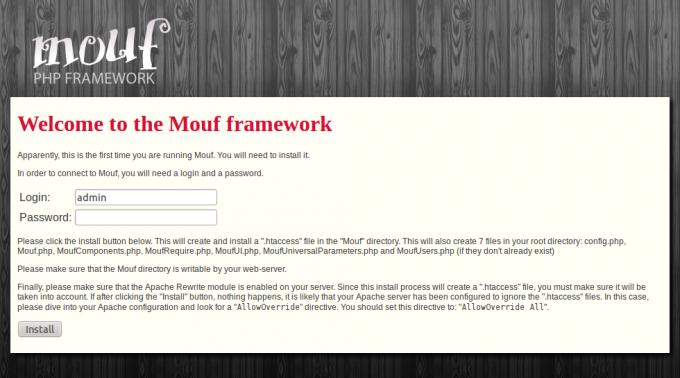
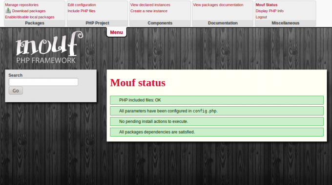

Installing Mouf
===============

<iframe width="640" height="480" src="//www.youtube.com/embed/19BVLfIuZf0" frameborder="0" allowfullscreen></iframe>

Requirements:
---------------------
To run Mouf 2, you will need PHP 5.3.9+ running on Apache.
The **php_curl** and **php_openssl** extensions must be enabled, as well as the *mod_rewrite* for Apache.

Your *memory_limit* settings in *php.ini* must be set at least to 256M.

<div class="alert alert-info"><strong>Note:</strong> Although Mouf only requires PHP 5.3.9+, a set of
Mouf packages (especially those related to renderers) will require PHP 5.4+, so it might be a good
idea to start with the highest possible PHP version.</div>

Download Mouf 2:
--------------------------

Mouf comes as a composer package (the name of the package is mouf/mouf)

### Downloading Composer
Not used to Composer? Here is a guide to install it.

#### Using Linux or MacOS
The first step is installing Composer. This is essentially a one line process. At the root of your project directory, type:

<pre>
curl -s https://getcomposer.org/installer | php
</pre>

#### Using Windows
Windows users can download the phar file at the bottom of the page here: [http://getcomposer.org/download/](http://getcomposer.org/download/). 
Past the composer.phar file at the root of your project.

<div class="warning"><strong>Heads up!</strong> Windows users should not use the Composer Windows installer. Instead, download the "phar" file and put it at the root of your project.
Mouf requires that file to be at this exact place.</div>

### Using Composer to download Mouf
At this point, you should have a composer.phar file at the root of your project.
In the same directory create a <code>composer.json</code> file:

```
{
    "require": {
        "mouf/mouf": "~2.0"
    } 
}
```

and finally, from the command line, at the root of your project, run:

```
php composer.phar install
```

For Windows users, make sure your "php.exe" file is part of [your PATH environment variable](http://www.php.net/manual/en/faq.installation.php#faq.installation.addtopath).

Install Mouf 2:
---------------
Once Mouf 2 is downloaded, you still have to do the setup.
For this, start your browser and navigate to: http://[yourserver]/[yourapp]/vendor/mouf/mouf

You will see the install screen:



Choose a login and a password to log into Mouf. Then, click the "Install" button. You are done! If the install completed successfully, you should see the Mouf main page:



Defining directory permissions:
-------------------------------
One of the most common problems faced when installing Mouf on a Linux environment is 
managing to share the write permission. Your current user must be able to access and edit the files,
but Mouf will also need to access and edit some of those files. Since Mouf is a PHP application,
it will be executed using the "Apache" user (assuming you are using Apache).

The name for the Apache user is usually "www-data" (for Debian/Ubuntu variants), or "apache" (for
Redhat/CentOS family). 

If you are not sure, and if the file permissions are not correct, the Mouf installer will help you find 
the name of the Apache user.

The easiest and more portable way of sharing your rights with the Apache user is to be part of the same
Unix group.

To do this, you can run (on Ubuntu/Debian flavored Linux):

```
sudo adduser `whoami` www-data
sudo adduser www-data `whoami`
```

This will add your current user to the "www-data" group, and add the "www-data" group to your current user.
Obviously, this assumes the Apache user is "www-data". This might be a different name on your server.

Now, we need to give write access to the group. To do this, you can use this command in your project's root directory:

```
sudo chmod g+w * -R
```

###Production servers

Mouf UI is designed to be used on a development environment, not on a production server.
If you are running a production server (if you are not on a development environment), it is more secure
to prevent Apache from writing to the application directories (or to open those rights on a very
restrictive basis). In this scenario, you don't need to share write rights with Apache. 
