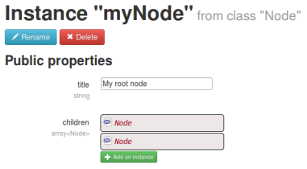
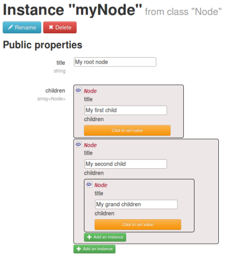

Using annotations to make dependency injection even easier
==========================================================

[Mouf helps you set up your dependency-injection container using a nice graphical user interface.](mouf_di_ui.md)

- [Deep-linking into instances](#deeplinking)
- [Adding logo to your instances](#addinglogo)

<a id="deeplinking"></a>
Deep-linking into instances
---------------------------

When you have a look at an instance in Mouf, you can see to which instances this instance is bound.
But you don't know the content of those instances.

Here is a simple sample with a `Node` class that has a `title` and `children` nodes.

```php
class Node implements HtmlElementInterface {
	/**
	 * @var string
	 */
	public $title;
	
	/**
	 * @var Node[]
	 */
	public $children;
}
```

A typical node instance will look like this:



You can improve user experience in Mouf by adding the **@Important** annotation.

```php
class Node implements HtmlElementInterface {
	/**
	 * @Important
	 * @var string
	 */
	public $title;
	
	/**
	 * @Important
	 * @var Node[]
	 */
	public $children;
}
```

Just put the annotation in your public property / setter / constructor docblock.

You will now see this:


See the difference? It is much easier to see what we are doing now. However, you must still
declare yourself what should be displayed (using @Important) and what should be hidden. Indeed,
if Mouf made everything visible at once in all instances displayed, it would soon be unusable.



Note: in a constructor, you can decide which parameters are important and which are not important
by passing the parameter name after the annotation. Here is a sample:

```php
/**
 * @Important $a
 */
public function __construct($a, $b=null) {

}
```

<a id="addinglogo"></a>
Adding logos to your instances
------------------------------

When you look at an instance in Mouf, it has a small logo next to it.
Usually, this is a "PHP file" logo:


Did you know you can customize this logo using an annotation? Here is how to do it:

```php
/**
 * A class with a special logo
 *
 * @Renderer { "smallLogo":"images/my_custom_logo.png" }
 */
class MyClass {

}
```

The **@Renderer** annotation can be used to add custom logos to your instances.
The path you put in the "smallLogo" property should not start with a / and will be relative to your application's
ROOT_URL.

Here is a sample instance with a custom logo:

