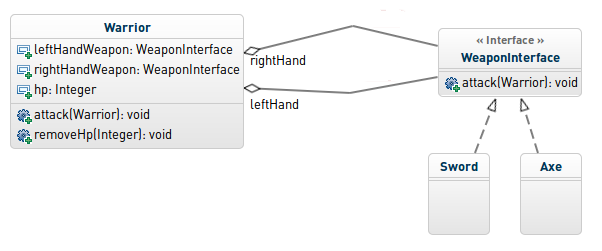
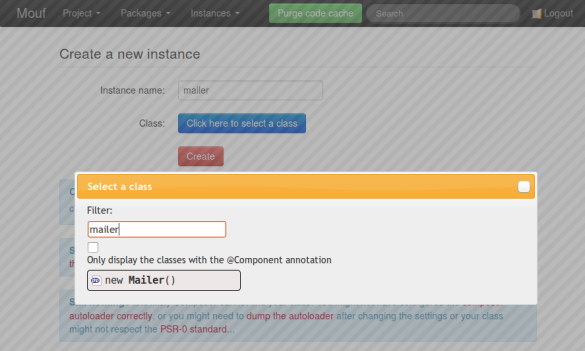
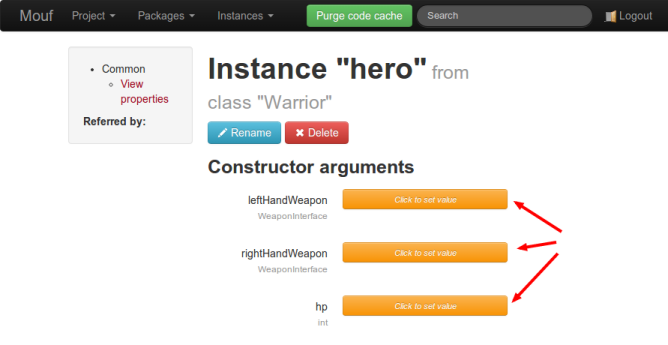
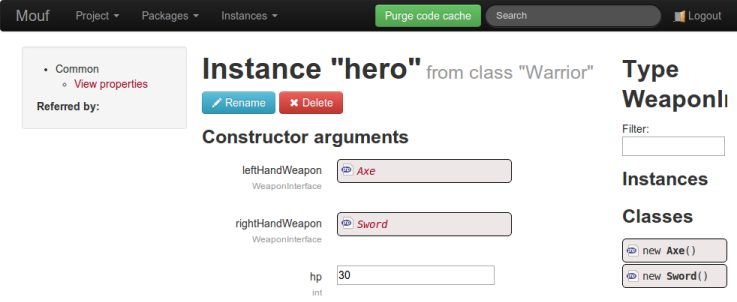
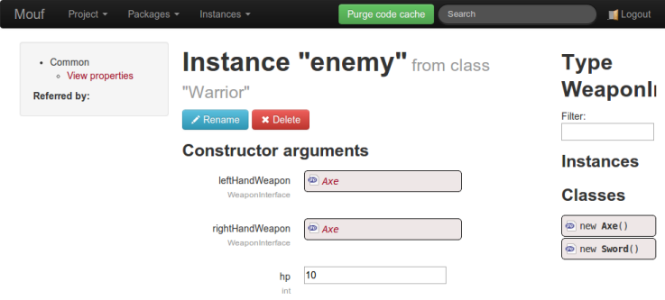

Getting started with Mouf's user interface
==========================================

In this document, we will show how to use Mouf DI framework to create and fetch instances.

You can use Mouf to create any kind of instances from any classes (mostly *services* and
*components* as you probably [read in the previous chapter](dependency_injection.md)).

In order not to prove Mouf is truly generic, we will take a completely abstract sample 
that is not related to web development. Our sample will be about role-playing games!

<a href="http://mouf-php.com/packages/mouf/mouf/doc/mouf_di_ui.md" class="hidden">You are viewing this content from Github (that does not support
video embedding. Click here to view the video.</a>
<iframe width="800" height="600" src="//www.youtube.com/embed/UVeD20y5bWI?rel=0&vq=hd720" frameborder="0" allowfullscreen></iframe>

**Finished the video? In a hurry?** <a href="injection_techniques.md" class="btn btn-primary">Directly jump to the next video about supported injection techniques</a>

The playground
--------------

Here is our test class diagram.



In this application, we will have 2 warriors (class `Warrior`) that will fight.
Each warrior has 2 weapons (one in the left hand and one in the right hand). A weapon
is a object implementing the `WeaponInterface`. We have 2 concrete implementations: `Axe` and `Sword`.

Using Mouf, we will create 2 instances of `Warrior`: a `$hero` and an `$enemy`.
We will use Mouf to **inject** weapons into this instances.

Prerequisite
------------

Before creating the instances, we must create the classes we want to instantiate.

If you are used to create classes that respect the PSR-0 or PSR-4 naming conventions,
just have a quick look at our test classes and jump to the next session.

- [Class `Warrior`](https://github.com/thecodingmachine/samples.tutorial/blob/master/src/Mouf/Sample/Warrior.php#L14)
- [Interface `WeaponInterface`](https://github.com/thecodingmachine/samples.tutorial/blob/master/src/Mouf/Sample/WeaponInterface.php)
- Classes [`Axe`](https://github.com/thecodingmachine/samples.tutorial/blob/master/src/Mouf/Sample/Axe.php)
  and [`Sword`](https://github.com/thecodingmachine/samples.tutorial/blob/master/src/Mouf/Sample/Sword.php)

<div class="alert">If you are not familiar with PSR-0, PSR-4 or Composer's autoloading technique, this is something you need to learn
right now.
Please read the <a href="creating_php_classes_with_composer.md">Creating PHP classes with Composer guide</a>
before going any further.</div>

You can also install a test project containing the sample classes very easily using Git and Composer:

```sh
git clone https://github.com/thecodingmachine/samples.tutorial.git
php composer.phar install
```

Creating the instances
----------------------

When you log into Mouf, you can see an **Instances** menu. From this menu
we will manage our instances.


You can:

- View all the declared instances
- Create a new instance

Since we are just getting started, we have no instances defined so far. We will therefore create a new instance.


Let's start by creating the "hero" instance.

<div class="alert alert-info"><b>Tip:</b> Usually, an instance can be compared to a variable, so we like to use the same naming convention as variable.
So if you are using lower-case letters for your variables, you can do the same for your instances.</div>

Click on the **Create a new instance** menu link.

On the new instance page that appears, you must give a name to your instance, and also specify the type of the 
class to instanciate. A search box with a filter will help you to find your class quickly.



Configuring the instances
-------------------------

Once the instance is created, we arrive on the instance configuration page:



As you can see, Mouf has been able to detect the constructor arguments.

```php
class Warrior {
	...
	public function __construct(
			WeaponInterface $leftHandWeapon, 
			WeaponInterface $rightHandWeapon,
			$hp
			) {
		$this->leftHandWeapon = $leftHandWeapon;
		$this->rightHandWeapon = $rightHandWeapon;
		$this->hp = $hp;
	}
	...
}

```


Actually, Mouf can detect 3 types of properties that can be "injected" (it means "configured"):

- **Constructor arguments**: any argument in a constructor can be configured in Mouf (actually, any
  argument that is not compulsory MUST be configured in Mouf, otherwise, Mouf won't be able to
  instantiate the object)
- **Public properties**: any public property of a class can be edited using Mouf
- **Setters**: any setter (a function with one parameter starting with the 3 letters "set") can be
  called by Mouf.
  
You can learn more about those 3 types of injection in the ["Supported injection techniques" page](injection_techniques.md#supportedinjectiontechniques).

In this sample, we are going to create a `Axe` and a `Sword` instance and give it to our hero.
To do this, we just have to press the orange button next to "leftHandWeapon".

Here is what happens:


First of all, you can see that Mouf is displaying, in the right column, a way to create new `Axe` and
`Sword `instances.
This is because both classes implement the `WeaponInterface` and because the `leftHandWeapon` constructor's parameter 
must be a `WeaponInterface`.

Mouf correctly manages to infer the type of each argument of the constructor. [Check the documentation about
type inference](injection_techniques.md#typeinference) if you want to learn more about the way Mouf does this..

There are many supported types in Mouf (classes, primitive types, arrays, ...). To learn more, check
the [supported types document](supported_types.md).

Now, we want to create a new `Axe` instance and feed it to our hero's left hand and 
a new `Sword` instance into our hero's right hand.

To do this, we can simply drag'n'drop the `new Axe()` icon into the "leftHandWeapon" constructor's parameter
of the "hero" instance. We will also set the hit points of our hero using
the last parameter of the constructor.

Once the drag'n'drop is completed, we see this:



<div class="alert alert-info">Note: unlike the "hero" instance, that has a name, these new instances
we just created do not have names yet. In Mouf, we call them <strong>anonymous instances</strong>.
Anonymous instances are connected to only one instance. If we want to bind the `Sword` instance to another instance,
we need to give it a name (by clicking the "Rename" button on the instance page).</div>

A click on the anonymous "Sword" instance we just created will land us on the sword instance page.

Finally, we can also fill the `hp` parameter (a primitive type) directly in the UI.

For the purpose of this tutorial, we will also create a second `Warrior` instance and call it `enemy`.



Using the instances
-------------------

We have now successfully created our instances, but we don't know yet how to use them.

When you configure your instances, Mouf creates a `Mouf` class. This class contains functions
that will allow you to access your instances, through **static getters**. We have 2 instances: `hero`
and `enemy`. We can access those through the `Mouf::getHero()` and `Mouf::getEnemy()` method.

Before calling the `Mouf` class, you have to be sure that Mouf DI component is initialized. This
is simply done by including the `mouf/Mouf.php` file.

So to have a fight between our characters, we would simply write:

**fight.php**
```php
require 'mouf/Mouf.php';

$hero = Mouf::getHero();
$enemy = Mouf::getEnemy();

$hero->attack($enemy);
// Will print "I'm dead!"
```

Container-interop compatibility
-------------------------------
Mouf is [fully compatible with the **container-interop** project](http://github.com/container-interop/container-interop).
Actually, Mouf is one of the project that started **container-interop**.

You can access the instance by its name, using the `MoufManager` class. For instance:

```php
require_once 'mouf/Mouf.php';

// The $moufManager object represents the DI container
$moufManager = MoufManager::getMoufManager();

if ($moufManager->has('hero')) {
	$hero = $moufManager->get('hero');
}

```

Using the *Mouf* class and the *MoufManager* class
--------------------------------------------------

<div class="alert alert-info"><strong>Warning!</strong> It is usually not considered a good
practice to access your instances using the <code>Mouf</code> class or the
<code>MoufManager</code> class. Indeed, if you do so, you are using the dependency
injection container as a <strong>service locator</strong>. The service locator pattern
is usually considered harmful, because your code depends on the service locator.
Instead, you should rely on an <a href="http://mouf-php.com/packages/mouf/mvc.splash/index.md">MVC framework that will use the DI container itself</a>.
This way, you get a controller with all instances directly injected.</div>

As a rule of thumb, if your code is using a nice MVC framework (like Splash) and
if your code is calling the `Mouf` class or the `MoufManager` class, you are probably doing
something wrong and you might want to reconsider what you are doing.

If you want to read more about why the service locator pattern is an anti-pattern,
[check this article](http://blog.ploeh.dk/2010/02/03/ServiceLocatorisanAnti-Pattern/).


Where are the instances stored?
-------------------------------

So far, we used Mouf as a black box. But there is no magic, Mouf has to store the 
instances we defined somewhere! Actually, all instances are stored in the
**mouf/MoufComponents.php** file.

Usually, you will never have a look at that file. It is quite long and you never edit
it manually, instead you use Mouf UI.

If you are working in a team however, with a version control system, if you
are creating an instance and one of your colleagues is creating an instance,
you might get conflicts in that file.

Instances are all stored in one big array. Each key is an instance name and
the value is a descriptor of the instance. It is usually not that difficult
to resolve conflicts, since the array is self-descriptive.

Here is the portion of the **MoufComponents.php** file relative to the `hero` instance
we just created:

```php
$moufManager->addComponentInstances(array (
  ...
  'hero' => 
  array (
    'class' => 'Mouf\\Sample\\Warrior',
    'external' => false,
    'weak' => false,
    'constructor' => 
    array (
      0 => 
      array (
        'value' => '__anonymous__746802_1400434107610',
        'parametertype' => 'object',
        'type' => 'string',
        'metadata' => 
        array (
        ),
      ),
      1 => 
      array (
        'value' => '__anonymous__504284_1400434110615',
        'parametertype' => 'object',
        'type' => 'string',
        'metadata' => 
        array (
        ),
      ),
      2 => 
      array (
        'value' => '30',
        'parametertype' => 'primitive',
        'type' => 'string',
        'metadata' => 
        array (
        ),
      ),
    ),
  ),
  ...
));
```

Going further
-------------

Want to go further?

<a href="injection_techniques.md" class="btn btn-primary">Learn more about the supported injection techniques &gt;</a>

<a href="supported_types.md" class="btn">Learn more about the types supported by Mouf &gt;</a>

<a href="mouf_annotations.md" class="btn">Learn how to use annotations to make dependency injection even easier &gt;</a>