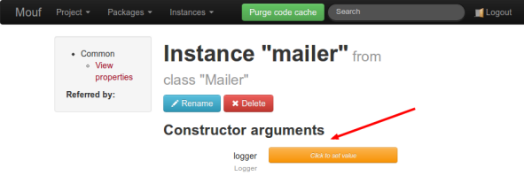
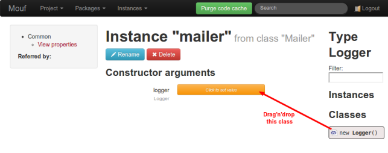
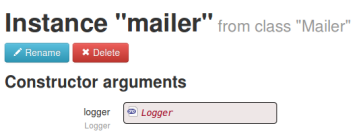
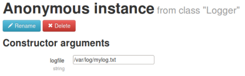

Getting started with Mouf's user interface
==========================================

In this document, we will show how to use Mouf DI framework to create and fetch instances.
We will create 2 instances (a Mailer and a Logger previously discussed in the 
[DI framework introduction](dependency_injection.md))

When you log into Mouf, you can see an **Instances** menu. From this menu
that we will manage our instances.


You can:

- View all the declared instances
- Create a new instance

Since we are just getting started, we have no instances defined so far. We will therefore create a new instance.

Creating the sample classes
---------------------------

Before creating the instances, we must create the classes we want to instantiate.
We are using Composer, and therefore, we can use the Composer autoloading system. The best thing to do is to
declare our classes using the PSR-0 notation. This is a PHP 5.3 thing (mostly), so we will also declare a namespace for the classes.
Let's put all our classes in the `Example` namespace.

Let's also say all the classes go into the `src` folder.

The first thing to do is to declare the namespace in `composer.json`:

```json
{
    "require": {
        "mouf/mouf": "~2.0"
    },
    "autoload": {
        "psr-0": {
            "Example": "src/"
        }
    },
    "minimum-stability": "dev" 
}
```

Have a look at the `autoload` section. We are declaring that the **Example** namespace will be in the `src/` directory.
This means that Mouf will be able to find any class in the `src\Example` directory, as long as they are respecting
the [PSR-0 naming scheme](https://github.com/php-fig/fig-standards/blob/master/accepted/PSR-0.md).

In our particular case, there will be 2 classes:

**src\Example\Mailer.php**
```php
<?php
namespace Example;

class Mailer {
	private $logger;
	
	/**
	 * @param Logger $logger
	 */
	public function __construct($logger) {
		$this->logger = $logger;
	}
	
	public function sendMail($to, $title, $text) {
		// Do stuff to send the mail
		// Once sent, let's log it.
		$this->logger->log("Mail sent");
	}
}
```

**src\Example\Logger.php**
```php
<?php
namespace Example;

class Logger {
	private $fp;

	public function __construct($logfile) {
		$this->fp = fopen($logfile, "a");
	}
	
	public function log($text) {
		fwrite($this->fp, $text);
	}

}
``` 

Creating the instances
----------------------

Let's start by creating the "mailer" instance.

Usually, an instance can be compared to a variable, so we like to use the same naming convention as variable.
So if you are using lower-case letters for your variables, you can do the same for your instances.

Click on the **Create a new instance** menu link.

On the new instance page that appears, you must give a name to your instance, and also specify the type of the 
class to instanciate. A search box with a filter will help you to find your instance class quickly.

  

Configuring the instances
-------------------------

Once the instance is created, we arrive on the instance configuration page:



As you can see, Mouf has been able to detect the constructor arguments.
Actually, Mouf can detect 3 types of properties that can be "injected" (it means "configured"):

- **Constructor arguments**: any argument in a constructor can be configured in Mouf (actually, any
  argument that is not compulsory MUST be configured in Mouf, otherwise, Mouf won't be able to
  instantiate the object)
- **Public properties**: any public property of a class can be edited using Mouf
- **Setters**: any setter (a function with one parameter starting with the 3 letters "set") can be
  called by Mouf.

In this example, we are going to create a logger instance and give it to Mouf.
To do this, we just have to press the orange button next to "logger".

Here is what happens:



First of all, you can see that Mouf is offering, on the right a way to create a new "Logger" instance.
Actually, it would also offer us a way to connect any other "Logger" instance previously created, but we have none so 
far.

You might wonder how Mouf did to know that the "logger" variable is of type "Logger". Actually, Mouf has 2 
strategies for this:

- It will first look if the parameter has an explicit type. For instance:

  ```php
  public function setLogger(Logger $logger);
  ```
  
  In this function, the "Logger" type is declared in the function signature. It is easy.
- If the type is not available, Mouf will fallback to annotations to get the type. For instance:

  ```php
  /**
   * @param Logger $logger
   */
  public function __construct($logger) {
	$this->logger = $logger;
  }
  ```
  
  The **@param** annotation will be used to define the type of the $logger variable.
  If we were playing with public fields, we would use:
  
  ```php
  /**
   * @var Logger
   */
  public $logger;
  ```

<div class="alert alert-info"><strong>Heads up!</strong> When writing annotations, it is very important 
to use the PHPDoc syntax. In particular, your comments must start with /**, not with /* or //!</div>

There are many supported types in Mouf (classes, primitive types, arrays, ...). To learn more, check
the [supported types document](supported_types.md).

Now, we want to create a new "Logger" instance and feed it to our "mailer" instance.
To do this, we can simply drag'n'drop the "new Logger" icon into the "logger" property of the "mailer" instance.

Once the drag'n'drop is completed, we see this:



<div class="alert alert-info">Note: unlike the "mailer" instance, that has a name, this new instance
we just created does not have a name yet. In Mouf, we call it an <strong>anonymous instance</strong>.
Anonymous instance are connected to only one instance. If we want to reuse this logger (and we will
certainly want that, we need to rename the instance.</div>

A click on the anonymous "Logger" instance we just created will land us on the logger instance page.

The logger instance has one property (`logfile`), and it's type is `string`. Mouf will allow us
to configure the instance with text directly:



<div class="alert alert-info"><strong>Heads up!</strong> Most of the time, you will want to avoid
putting sensitive configuration in an instance. In this example, the logfile path might be different on
a development box and in production. Everything you configure in an instance will be shared between
all your development environments. Hopefully, you have the possibility to inject
a constant configured in the <code>config.php</code> file. See the 
<a href="configuration_management.md">configuration management document</a> to learn more
about this feature.</div>

Using the instances
-------------------

We have now successfully created our instances, but we don't know yet how to use them.

When you configure your instances, Mouf creates a `Mouf` class. This class contains static functions
that will allow you to access your instances, through getters. Since our instance name is "mailer",
we can access it through the `getMailer()` method.

Before calling the `Mouf` class, you have to be sure that Mouf DI component is initialized. This
is simply done by including the `mouf/Mouf.php` file.

So to use our mailer, we would simple write:

```php
<?php
require_once 'mouf/Mouf.php';

$mailer = Mouf::getMailer();
$mailer->sendMail('toto@example.com', 'title', 'body');
```

You can also access the instance by its name, using the `MoufManager` class. For instance:

```php
<?php
require_once 'mouf/Mouf.php';

$mailer = MoufManager::getMoufManager()->getInstance('mailer');
$mailer->sendMail('toto@example.com', 'title', 'body');
```

<div class="alert alert-info"><strong>Warning!</strong> It is usually not considered a good
practice to access your instances using the <code>Mouf</code> class or the
<code>MoufManager</code> class. Indeed, if you do so, you are using the dependency
injection container as a <strong>service locator</strong>. The service locator pattern
is usually considered harmful, because your code depends on the service locator.
Instead, you should rely on an <a href="http://mouf-php.com/packages/mouf/mvc.splash/index.md">MVC framework that will use the DI container itself</a>.
This way, you get a controller with all instances directly injected.</div>

If you want to read more about why the service locator pattern is an anti-pattern,
[check this article](http://blog.ploeh.dk/2010/02/03/ServiceLocatorisanAnti-Pattern/).

Where are the instances stored?
-------------------------------

So far, we used Mouf as a black box. But there is no magic, Mouf has to store the 
instances we defined somewhere! Actually, all instances are stored in the
**mouf/MoufComponents.php** file.

Usually, you will never have a look at that file. It is quite long and you never edit
it manually, instead you use Mouf UI.

If you are working in a team however, with a version control system, if you
are creating an instance and one of your colleagues is creating an instance,
you might get conflicts in that file.

Instances are all stored in one big array. Each key is an instance name and
the value is a descriptor of the instance. It is usually not that difficult
to resolve conflicts, since the array is self-descriptive.

Here is the portion of the **MoufComponents.php** file relative to the 2 instances
we just created:

```php
$moufManager->addComponentInstances(array (
  '__anonymous_1377678963176' => 
  array (
    'class' => 'Example\\Logger',
    'external' => false,
    'weak' => true,
    'anonymous' => true,
    'constructor' => 
    array (
      0 => 
      array (
        'value' => '/var/log/mylog.txt',
        'parametertype' => 'primitive',
        'type' => 'string',
        'metadata' => 
        array (
        ),
      ),
    ),
  ),
  'mailer' => 
  array (
    'class' => 'Example\\Mailer',
    'external' => false,
    'weak' => false,
    'constructor' => 
    array (
      0 => 
      array (
        'value' => '__anonymous_1377678963176',
        'parametertype' => 'object',
        'type' => 'string',
        'metadata' => 
        array (
        ),
      ),
    ),
  ),
));
```

Going further
-------------

Want to go further?

- [Learn more about the types supported by Mouf](supported_types.md)
- [Learn how to use annotations to make dependency injection even easier](mouf_annotations.md)

