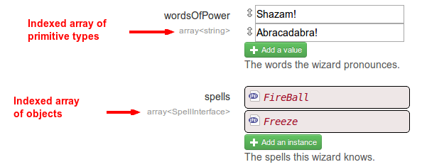

Supported types
===============

<a href="http://mouf-php.com/packages/mouf/mouf/doc/supported_types.md" class="hidden">You are viewing this content from Github (that does not support
video embedding. Click here to view the video.</a>
<iframe width="853" height="480" src="//www.youtube.com/embed/vRSVk6JnyOE?rel=0&vq=hd720" frameborder="0" allowfullscreen></iframe>

**Finished the video?** <a href="declare_instance_via_php_code.md" class="btn btn-primary">Learn more about using PHP code for injection &gt;</a>

There are 4 kinds of supported types:

- Primitive types
- Classes and interfaces
- Arrays (and associative arrays)
- Mixed types

Note: if you are using a third party library that requires injecting a type that is not supported,
you can always fallback to [injecting values via PHP code](declare_instance_via_php_code.md).

##Primitive types

Mouf supports those primitive types: `string`, 
`char`, 
`bool`, 
`boolean`, 
`int`, 
`integer`, 
`double`, 
`float`, 
`real`, 
`mixed`, 
`number`

If your type is one of those, you will be able to input text directly in the property in Mouf UI.
Note that there is a special behaviour for "bool" and "boolean". They are rendered as a checkbox in Mouf UI.

For instance:

```php
class Wizard {
	...
	/**
	 * @param string $name The name of the wizard
	 * @param int $hp The hit points of the wizard
	 * @param bool $isAlive Whether the wizard is alive or not
	 */
	public function __construct($name, $hp, $isAlive) {
		...
	}
	...
}
```

<div></div>


##Classes and interfaces

We already saw that classes and interfaces can be used as types in the example above.

In the Mouf user interface, these properties will be displayed like this:

```php
class Wizard {
	...
	/**
	 * The best pal of the wizard.
	 * @param Warrior $sideKick
	 */
	public function setSideKick(Warrior $sideKick) {
		$this->sideKick = $sideKick;
	}
	...
}
```

<div></div>


<div class="alert"><b>Best practice:</b> As much as possible, try putting on interface as the type
instead of a class. This is more flexible.</div>

##Arrays

Mouf does a difference between **indexed arrays** and **associative arrays** (aka maps).
Inside an array, you can inject primitive types or objects (but you cannot mix both, unless you
use the [injection via PHP code feature](declare_instance_via_php_code.md)).

###Indexed arrays

Here are 2 samples of indexed arrays.

```php
class Wizard {
	...
	/**
	 * The words the wizard pronounces.
	 * @param array<string> $wordsOfPower
	 */
	public function setWordsOfPower(array $wordsOfPower) {
		$this->wordsOfPower = $wordsOfPower;
	}

	/**
	 * The spells this wizard knows.
	 * @param SpellInterface[] $spells
	 */
	public function setSpells(array $spells) {
		$this->spells = $spells;
	}
	...
}
```

<div></div>




As you can notice, there are 2 ways to write arrays: using **brackets** or the **array** keyword.

Therefore, `string[]` and `array<string>` are similar.

###Associative arrays (aka maps)

Here are 2 samples of maps.

```php
class Wizard {
	...
	/**
	 * This wizard's masters => a map of Wizard objects
	 * @param array<string, Wizard> $masters
	 */
	public function setMasters(array $masters) {
		$this->masters = $masters;
	}
	
	/**
	 * This wizard's name in many contries.
	 * The key is the country code, the value is the name.
	 * @param array<string, string> $internationalNames
	 */
	public function setInternationalNames(array $internationalNames) {
		$this->internationalNames = $internationalNames;
	}
	...
}
```

<div></div>


As you can notice, associative arrays (or maps) can only be achieved using the **array<xxx, xxx>** notation.

###Generic "array" type

The "pure" `array` type is unsupported.

```php
class Wizard {
	...
	/**
	 * This is not supported
	 * @var array
	 */
	public $unsupported;
}
```

<div class="alert">If you are trying to create an instance of a class provided by
 a third party library, it is likely that you will
have at some point a property whose type is <code>array</code>. Mouf has no clue what can be injected in an
array (is it an array of strings? of objects? a map? In this case, you can still inject the value
you want by using the <a href="declare_instance_via_php_code.md">inject property by PHP code</a> 
option that will let you type some PHP code to fill the property.</div>

##Mixed types

Mouf does not support the **mixed** keyword.
However, you can use a pipe to declare that a property can have many different types.

For instance:

- `string|Healer|Warrior|Wizard` is a valid type

Let's rewrite the "sideKick" setter and assume that the sidekick of our wizard can be anything (a warrior, a healer,
another wizard or simply a string containing the name of someone:

```php
class Wizard {
	...
	/**
	 * The best pal of the wizard.
	 * @param string|Healer|Warrior|Wizard $sideKick
	 */
	public function setSideKick($sideKick) {
		$this->sideKick = $sideKick;
	}
	...
}
```

<div></div>


Using the UI, you can choose the type you want to inject by clicking on it.

<div class="alert">Using mixed types can be sometimes convenient, but is generally not a great idea.
As much as possible, the parameter's type of a constructor or a setter should be clearly defined.
Use this feature sparingly.</div>