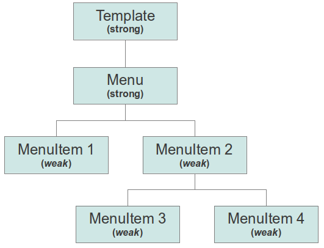

Weak instances
==============

What is a weak instance?
------------------------

When developing with Mouf, you might end up creating a lot of instances.
For instance, when developing a menu, you will have an instance for the menu, and an instance for each item of the menu.

Now, let's imagine you want to delete a menu. The menu, along the menu-items represent an instances grape.
You would have to delete the *menu* instance, and each menuitem, manually. This makes the task long, tedious and error-prone.

This is where “weak” instances come into play. Weak instances can be automatically **garbage-collected** when 
no other instance references them. Using the menu example, the menu would be a “strong” object and the menu-items 
would be “weak” objects.



In this sample, we declared all MenuItems to be **weak** instances.
Deleting the "Menu" instance will automatically destroy any "MenuItem" instance, because they would no more be 
connected to any "strong" instance. Also, deleting MenuItem 2 would automatically delete Menuitems 3 and 4.

However, deleting the "Template" instance will not delete the "Menu" instance. "Strong" instances are not garbage collected.

How do I declare a weak instance?
---------------------------------

Currently, you cannot make an instance "weak" in the Mouf user interface.
However, if you are a package developer, you can do it using the Mouf API:

```php
// Make the "myInstance" a "weak" instance
$moufManager->setInstanceWeakness('myInstance', true);
``` 
